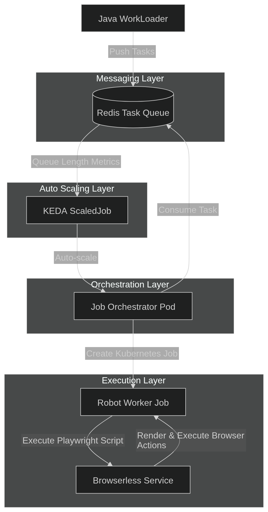

# RPA-Kind-Playwright

## Overview

RPA-Kind-Playwright is a Kubernetes-native Robotic Process Automation (RPA) platform that demonstrates event-driven automation using Redis, KEDA (Kubernetes Event-driven Autoscaling), and Playwright. The system orchestrates browser-based automation tasks through a scalable, containerized architecture.

## Architecture

### Core Components

1. **Redis Task Queue** - Central message broker for task distribution
2. **KEDA ScaledJob** - Auto-scales job orchestrators based on queue length
3. **Job Orchestrator** - Consumes tasks from Redis and creates Kubernetes Jobs
4. **Robot Workers** - Python Playwright scripts for browser automation
5. **Browserless** - Headless browser service for rendering
6. **Java WorkLoader** - Simple job runner for demonstration

### Technology Stack

- **Kubernetes** - Container orchestration
- **KEDA** - Event-driven autoscaling
- **Redis** - Message queuing
- **Playwright** - Browser automation
- **Java** - Task publishing
- **Docker** - Containerization

### Diagram



## Quick Start

### OS

#### Windows

For Windows environments, this project needs to  be executed inside a WLS (Windows Subsystem for Linux) terminal. See how to install it here:  [WSL](https://learn.microsoft.com/en-us/windows/wsl/install)

#### Linux

Any Linux distribution capable of running bash files will be able to test this project.

### Prerequisites

- Docker Desktop (with Kubernetes enabled)
- kubectl
- kind
- Java 21+ (for building Java components)
- Maven (for Java build)

### Installation

1. **Clone the repository**
   ```bash
   git clone https://github.com/Arguableplains/RPA-Kind-Playwright.git
   cd RPA-Kind-Playwright
   ```

2. **Run the setup script**
   ```bash
   chmod +x ./setup.sh
   ./setup.sh
   ```

   This will:
   - Create a local Kubernetes cluster with kind
   - Build and load Docker images
   - Deploy all necessary components

3. **Create sample jobs**
   ```bash
   chmod +x ./create-jobs.sh
   ./create-jobs.sh 5
   ```

   Creates 5 sample jobs in the Java WorkLoader namespace.
   
   When finished, the jobs will create 5 screenshots in "/data/output" directory, each one with their respective task id.
   
#### Installation Recording

If you want to see the setup script execution, you can use this link to Asciinema:
[](https://asciinema.org/a/KW9BoyS3EfS5BdQk)
   
## Project Structure

```
RPA-Kind-Playwright/
├── java/                           # Java components
│   ├── redis-task-publisher/       # Task publisher application
│   └── Dockerfile                 # Java container definition
├── k8s/                          # Kubernetes manifests
│   ├── KIND/                     # kind cluster configuration
│   ├── KEDA/                     # KEDA autoscaling configuration
│   ├── JobOrchestrator/          # Robot orchestration
│   │   ├── docker/              # Orchestrator container
│   │   ├── robots/              # Robot implementations
│   │   └── *.yaml               # RBAC and storage configs
│   ├── Browserless/              # Headless browser service
│   ├── JavaWorkLoader/           # Java job runner
│   └── redis/                   # Redis configuration
├── setup.sh                     # Installation script
├── create-jobs.sh               # Job creation utility
└── README.md                    # This file
```

## Robot Implementations

### Available Test Robots

1. **generate_invoice**
2. **run_analytics**
3. **cleanup_cache**
4. **sync_data**
5. **backup_database**
6. **process_payment**
7. **send_email**
8. **generate_report**

### Robot Development

Each robot is a Python script using Playwright with Browserless token authentication that performs a browser navigation and a screenshot (sample automation scenario):

```python
import os
import asyncio
from playwright.async_api import async_playwright

# Environment variables
BROWSERLESS_HOST = os.environ.get("BROWSERLESS_HOST", "browserless-service.browserless.svc.cluster.local")
BROWSERLESS_PORT = os.environ.get("BROWSERLESS_PORT", "3000")
BROWSERLESS_TOKEN = os.environ.get("BROWSERLESS_TOKEN", "")
TASK_ID = os.environ.get("TASK_ID", "unknown")

# Build Browserless URL with token authentication
BROWSERLESS_URL = f"ws://{BROWSERLESS_HOST}:{BROWSERLESS_PORT}/chromium/playwright"
if BROWSERLESS_TOKEN:
    BROWSERLESS_URL += f"?token={BROWSERLESS_TOKEN}"

async def main():
    print(f"Starting automation for task: {TASK_ID}")
    print(f"Connecting to Browserless: {BROWSERLESS_URL}")
    
    async with async_playwright() as p:
        browser = await p.chromium.connect(BROWSERLESS_URL)
        page = await browser.new_page()
        
        # Your automation logic here
        await page.goto("https://example.com")
        await page.screenshot(path=f"/data/output/result-{TASK_ID}.png")
        
        await browser.close()
    
    print("Automation completed successfully!")

if __name__ == "__main__":
    asyncio.run(main())
```

**Key Points:**
- Uses environment variables for configuration
- Builds WebSocket URL with optional token authentication
- Handles missing tokens gracefully
- Includes logging for debugging
- Uses standard output paths for result storage

## Scaling & Performance

### KEDA Configuration

The system uses Redis list length to trigger scaling:

```yaml
triggers:
- type: redis
  metadata:
    address: redis-server:6379
    listName: task_queue
    listLength: "1"
```

### Auto-scaling Behavior

- **Scale-out**: When queue length ≥ 1
- **Scale-in**: When queue is empty
- **Max replicas**: 10 (configurable)
- **Polling interval**: 5 seconds

## Monitoring & Debugging

### Check Pods Status

```bash
kubectl get pods --all-namespaces
kubectl logs -f pod/<pod choosen to see its logs> -n <namespace>
``` 

## Security Considerations

- Robots run with minimal RBAC permissions
- Browserless token authentication
- Network policies isolate components
- Volume permissions for output storage

## Troubleshooting

### Common Issues

1. **Docker daemon not running**
   ```bash
   sudo systemctl start docker
   ```

2. **KEDA installation failure**
   Ensure internet connectivity for downloading KEDA manifests

3. **Redis connection issues**
   Verify Redis service is running: `kubectl get svc -n redis-server`

4. **Robot execution failures**
   Check robot logs: `kubectl logs job/xxxx -n robots`

## Contributing

This project is archived and not accepting contributions. For educational purposes only.

## License

This project is provided for educational demonstration purposes only. No warranty or support is provided.
